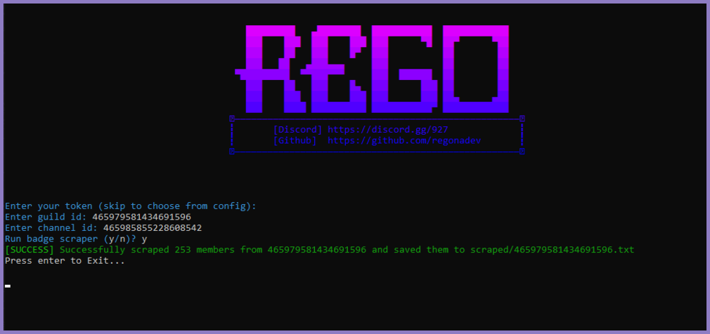

##### [🌍 Discord Server](https://discord.gg/927) | [❓ Do you need help ?](https://t.me/regonaa)

# 🔎 - Discord Badge Scraper:
A basic tool to find good badges on a Discord server.

# 📷 - Screenshot

# 📋 - Terms
- [x] Educational purpose only
- [x] Reselling is forbidden
- [x] I am **NOT** responsible of anything you do with our software
- [ ] This code is only a basic source code, so if you want to change, modify, update it, you can

# ❓ - How to Setup ?
1. Download .zip file.
2. Open `config.json`
3. Put your account token.
4. Save your file, then execute `run.bat`.
5. Wait till the Scrap finish.
6. When the scanning process is finished, it will be saved with the `ID` of the server created in the `scraped` folder.

**I'll be happy if you star this repo! ⭐ [regonadev](https://github.com/regonadev)**
